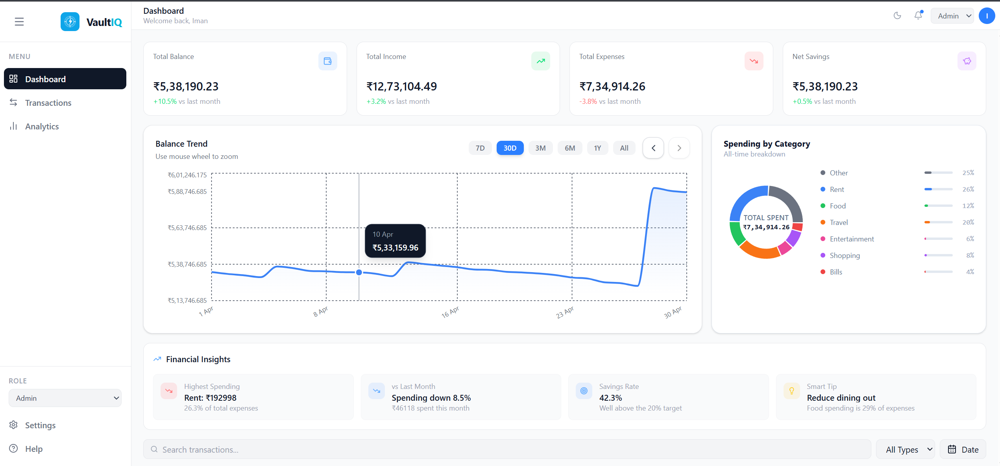
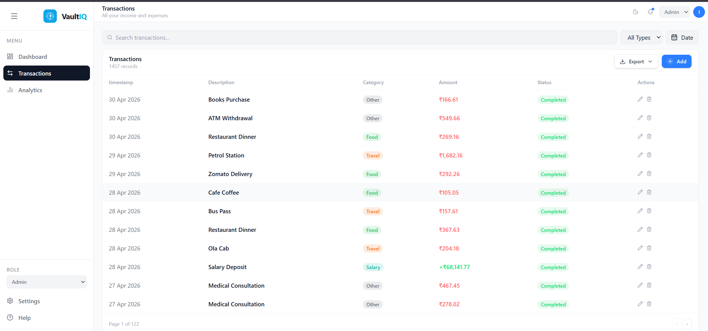

<div align="center">


# VaultIQ

**A personal finance dashboard built for clarity, not complexity.**

Track income, visualize spending patterns, and forecast your balance: all in one place.

[](https://vaultiq.imandatta.com)
[](https://github.com/Iman-Datta/VaultIQ)
[](https://react.dev)
[](https://redux-toolkit.js.org)
[](https://tailwindcss.com)
[](https://vitejs.dev)

</div>

---

## What is VaultIQ?

VaultIQ is a frontend finance dashboard built to explore, filter, and understand 16 months of personal transaction data — from salary credits to daily expenses. It goes beyond a standard dashboard with real chart interactivity, a synthetic dataset of 1,457 transactions, role-based UI, dark mode, and localStorage persistence.

No backend. No authentication. Just a fast, clean, data-rich frontend.

---

## Pages

### Dashboard
The main view. Four KPI summary cards show Total Balance, Total Income, Total Expenses, and Net Savings — each with a month-over-month percentage delta. Below that, a Balance Trend area chart sits alongside a Spending by Category donut chart. A Financial Insights strip rounds out the page with contextual observations drawn from the data.

### Analytics
A deeper look at the numbers. Monthly income vs expense bars with a running balance line, a Budget vs Actual tracker that turns red when a month goes over budget, a 3-month Balance Forecast, and a full spending breakdown donut: all in one view.

### Transactions
1,457 records spanning January 2025 to April 2026. Searchable, filterable by type, sortable by date or amount, and paginated at 12 rows per page across 122 pages.

---

## Features

### Charts and Interactions

**Balance Trend** — Area chart with time range selectors (7D, 30D, 3M, 6M, 1Y, All). Scroll the mouse wheel on the chart to zoom in and out. Use the arrow buttons to pan backward through historical windows.

**Spending Donut** — Hover over any slice to highlight it and update the center label with that category's name, value, and percentage. Other slices fade out.

**Monthly Comparison** — Grouped bar chart showing income (green) and expenses (red) side by side, with a running balance line overlaid.

**Budget vs Actual** — Month-by-month bars that turn red when spending exceeds the budget and blue when under. Navigate between months using arrow buttons.

**Balance Forecast** — Projects the next 3 months using recent trend data. Actual history in blue, forecast in dashed green.

### Role-Based UI

Roles are simulated entirely on the frontend via a sidebar dropdown. No backend required.

| Role | Access |
|------|--------|
| Viewer | Read-only access to all data, charts, and transactions |
| Admin | Full access including add, edit, and delete on transactions |

Switch roles live to see the UI adapt in real time.

### Guided Tour

First-time visitors are greeted with a 4-step modal tour that highlights non-obvious interactions — chart zoom, arrow navigation, and donut hover behavior. The tour only appears once, tracked via localStorage. It can be replayed at any time using the Help button in the sidebar.

## Preview

### Dashboard


### Transactions


### Other

- Dark and light mode with persistent preference
- localStorage sync — transactions survive hard refresh
- Fully responsive — sidebar collapses on mobile, charts reflow
- Pure SVG logo — pixel-perfect at any size

---

## The Dataset

Transactions are synthetically generated in Python to simulate a realistic working-professional finance history.

| Property | Detail |
|----------|--------|
| Period | January 2025 to April 2026 (16 months) |
| Volume | 1,457 transactions, 2–5 per day |
| Timestamps | Spread across morning, afternoon, evening, and night slots |
| Income | Monthly salary (52k–70k) plus irregular freelance (4k–14k, 1–3 times per month) |
| Categories | Salary, Freelance, Food, Rent, Bills, Entertainment, Shopping, Travel, Other |

Every month has income greater than expenses. The running balance grows consistently over time.

---

## Tech Stack

| Layer | Tool |
|-------|------|
| UI Framework | React 18 |
| State Management | Redux Toolkit |
| Styling | Tailwind CSS |
| Charts | Recharts |
| Build Tool | Vite |
| Persistence | localStorage |
| Data | Synthetic CSV — 1,457 rows |

---

## Getting Started

```bash
# Clone the repository
git clone https://github.com/Iman-Datta/VaultIQ.git
cd VaultIQ

# Install dependencies
npm install

# Start the development server
npm run dev
```

Open [http://localhost:5173](http://localhost:5173) in your browser.

```bash
# Production build
npm run build

# Preview the production build locally
npm run preview
```

---

## Assignment Coverage

This project was built for a Finance Dashboard UI frontend assignment. Every core requirement and all optional enhancements are implemented.

**Core requirements**

- Dashboard with summary cards and multiple visualizations
- Transactions section with date, amount, category, and type
- Filtering by type, sorting by date and amount, and search
- Role-based UI — Viewer (read-only) and Admin (full CRUD)
- Insights section with highest category, MoM comparison, savings rate, and a smart tip
- State management via Redux Toolkit for transactions, filters, and role
- Responsive design across mobile, tablet, and desktop

**Optional enhancements — all implemented**

- Dark mode
- localStorage persistence
- Animations and transitions on charts and hover states
- Advanced filtering with type, sort field, sort direction, and date range

---

## Known Issues

| Issue | Status |
|-------|--------|
| Cards page is a placeholder | Coming soon |
| Chart touch interactions on mobile not fully optimized | Planned |

---

<div align="center">

Built with React, Redux Toolkit, Tailwind CSS, and Recharts.

[vaultiq.imandatta.com](https://vaultiq.imandatta.com)

</div>
